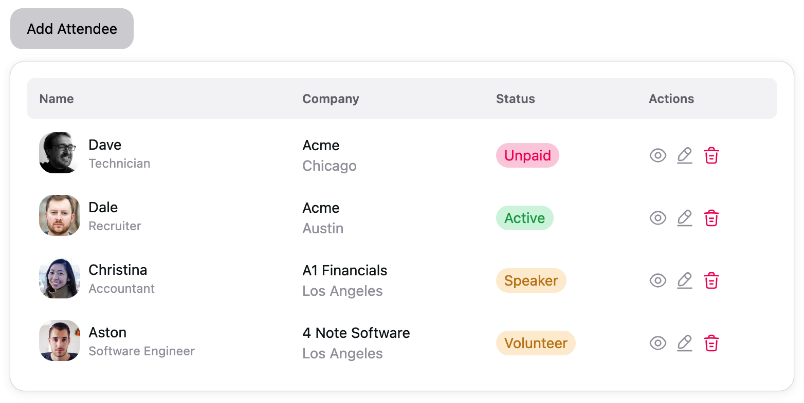

# NextUI Table

Simple project using NextUI table.



## Setup

1. Run the application.

   ```shell
   npm install
   npm run dev
   ```

1. Navigate to <http://localhost:3000>.

## Notes

1. To dynamically construct the table row, we use the following code:

   ```jsx
   <TableBody items={attendees}>
     {
       (item) => (
         <TableRow key={item.key}>
           {
             (colKey) => (
               <TableCell>{renderCell(item, colKey)}</TableCell>
             )
           }
         </TableRow>
       )
     }
   </TableBody>
   ```
   
   This gives good rendering performance as the rendered content is cached. But there are some cases when we do want 
   to reload the table whenever there's a page refresh. If that's the case, then we want to use the `map` method to 
   iterate through the `items` array.

   ```jsx
   <TableBody>
     {
       attendees.map((item) => (
         <TableRow key={item.key}>
           {
             (colKey) => (
               <TableCell>{renderCell(item, colKey)}</TableCell>
             )
           }
         </TableRow>
       ))
     }
   </TableBody>
   ```

## Reference and Credits

This project is based on the [NextUI Table example](https://nextui.org/docs/components/table#custom-cells) with 
images from [Baldur's Gate Wiki](https://bg3.wiki/).

* [NextUI: Table](https://nextui.org/docs/components/table)
